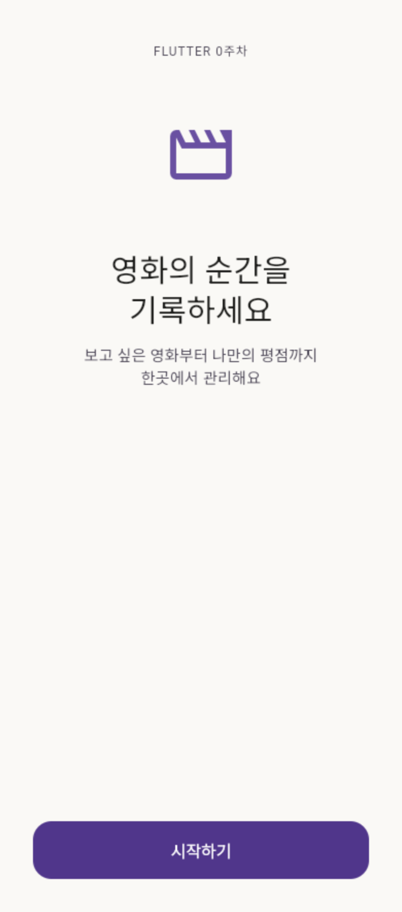

# MovieLog

Flutter 0주차 학습: 영화 기록 앱의 시작 화면을 구현합니다.

## 실행

```sh
flutter pub get
flutter run
```

## 실행 화면

Chrome에서 웹 빌드를 390 × 884 크기로 실행한 화면입니다. 기기의 상태 표시줄과 안전 영역에 따라 여백은 달라질 수 있습니다.



## 학습 기록

- `MaterialApp`은 앱 설정, `Scaffold`는 화면의 기본 틀을 담당합니다.
- `Column`으로 요소를 세로로 배치하고 `Padding`과 `SizedBox`로 여백을 조절했습니다.
- `Spacer`가 남은 공간을 채우도록 해서 시작하기 버튼을 하단에 배치했습니다.
- `Icons.movie_outlined`를 사용하면 별도 이미지 파일 없이 영화 아이콘을 표시할 수 있습니다.
- `ThemeData()`는 const 생성자가 아니므로 이를 포함하는 `MaterialApp`의 `const`를 제거해 오류를 해결했습니다. `const StartScreen()`은 유지할 수 있습니다.
- 일반 따옴표 문자열의 줄바꿈은 코드에서 직접 줄을 끊는 대신 `\n`으로 표현했습니다.

현재 시작하기 버튼은 SnackBar 안내 메시지를 표시합니다. 다음 학습에서는 화면 이동과 다양한 화면 크기에 대응하는 배치를 다룰 예정입니다.

## 검증

```sh
flutter analyze
flutter test
flutter build web
```

위젯 테스트로 시작 화면의 문구·아이콘과 버튼을 누른 뒤 표시되는 안내 메시지를 확인합니다.
