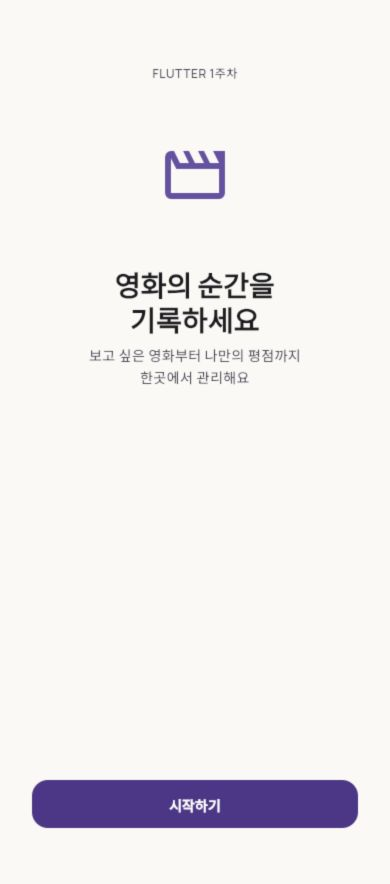
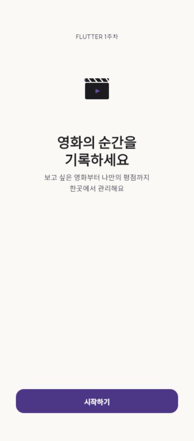
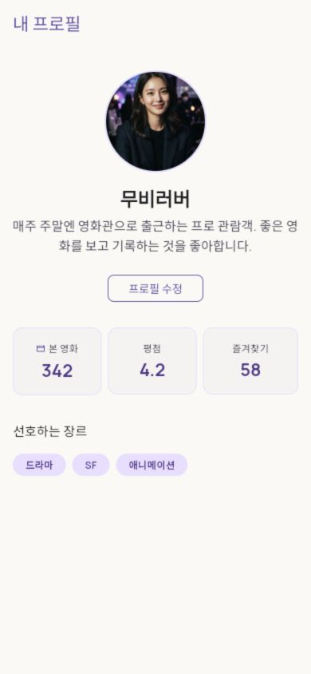
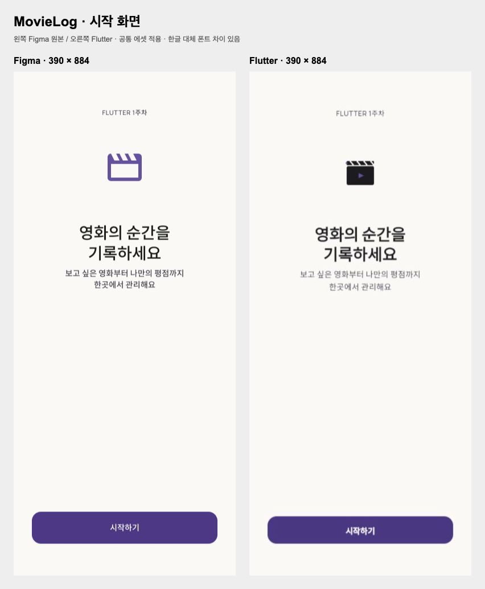
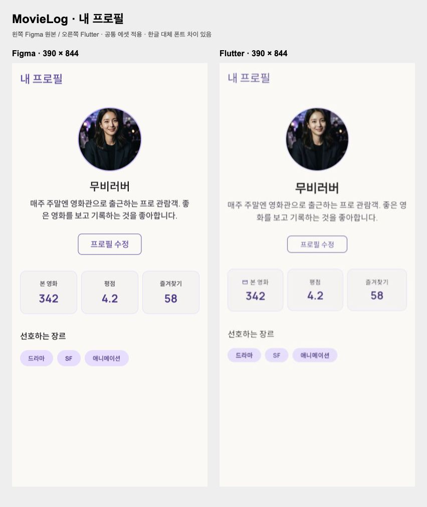

# MovieLog

Flutter 1주차: 기본 Widget, Material 3 테마, 로컬 Asset을 활용한 시작 화면과 정적인 영화 취향 프로필.

## 실행

```sh
flutter pub get
flutter run -d chrome
```

프로필: `flutter run -d chrome -t lib/main_profile.dart`

기본 Icon 비교: `flutter run -d chrome -t lib/main_start_icon.dart`

각 실행 파일은 MaterialApp.home만 다르게 설정합니다. 버튼은 빈 콜백이며 화면 이동·입력·NavigationBar는 연결하지 않았습니다.

## 화면

| 기본 Icon | 공통 SVG 로고 | 프로필 |
| --- | --- | --- |
|  |  |  |

공통 에셋을 적용하고 Figma 시작·프로필 화면과 비교했습니다. 원본과 구현의 차이는 제출 문서에 기록했습니다. [에셋 출처](assets/README.md)를 확인하세요.

## 학습 및 제출

- [복붙할 제출 내용과 위치](docs/week-1-submission.md)
- [Widget Tree 및 핵심 개념](docs/week-1-widget-tree.md)
- `lib/theme/`: AppColors, AppTextStyles, AppTheme
- `lib/widgets/common_app_bar.dart`: 공용 AppBar
- `lib/screens/`: 시작·프로필 화면과 의미 단위 Widget

## 검증

`flutter analyze`, `flutter test`, `flutter build web`

390×884 / 320×568 배치와 에셋 로딩, 정적인 버튼, 프로필 이미지 누락 시 대체 아이콘을 검증합니다.

## Figma 비교




