# MovieLog

Flutter 학습 프로젝트: 1주차 정적 화면과 2주차 회원가입 Form·평점 입력.

## 실행

```sh
flutter pub get
flutter run -d chrome -t lib/main_signup.dart
```

프로필: `flutter run -d chrome -t lib/main_profile.dart`

기본 Icon 비교: `flutter run -d chrome -t lib/main_start_icon.dart`

각 실행 파일은 MaterialApp.home만 다르게 설정합니다. 1주차 화면의 버튼은 빈 콜백이며, 2주차는 로컬 상태로 회원가입 입력·검증과 평점 선택을 처리합니다. 실제 API와 NavigationBar는 연결하지 않았습니다.

## 화면

| 기본 Icon | 공통 SVG 로고 | 프로필 |
| --- | --- | --- |
| 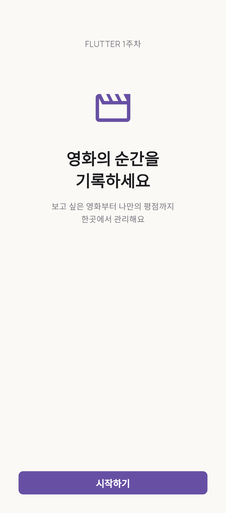 | 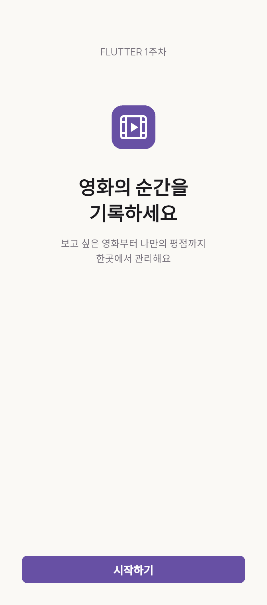 | 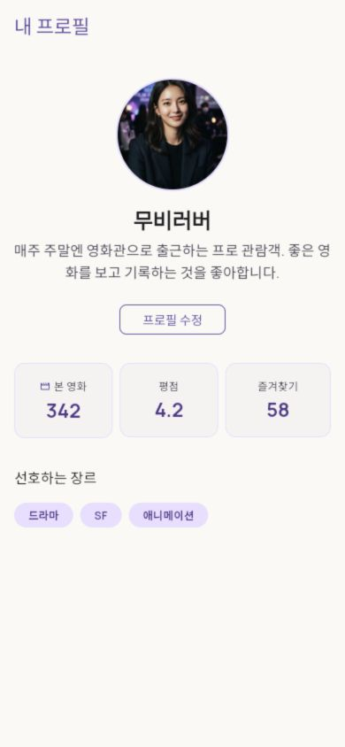 |

공통 에셋을 적용하고 Figma 시작·프로필 화면과 비교했습니다. 원본과 구현의 차이는 제출 문서에 기록했습니다. [에셋 출처](assets/README.md)를 확인하세요.

## 학습 및 제출

- [복붙할 제출 내용과 위치](docs/week-1-submission.md)
- [Widget Tree 및 핵심 개념](docs/week-1-widget-tree.md)
- `lib/theme/`: AppColors, AppTextStyles, AppTheme
- `lib/widgets/common_app_bar.dart`: 공용 AppBar
- `lib/screens/`: 시작·프로필 화면과 의미 단위 Widget

## 검증

`flutter analyze`, `flutter test`, `flutter build web`

390×884 / 320×568 배치와 에셋 로딩, 정적인 버튼, 프로필 이미지 누락 시 대체 아이콘을 검증합니다.

## Figma 비교

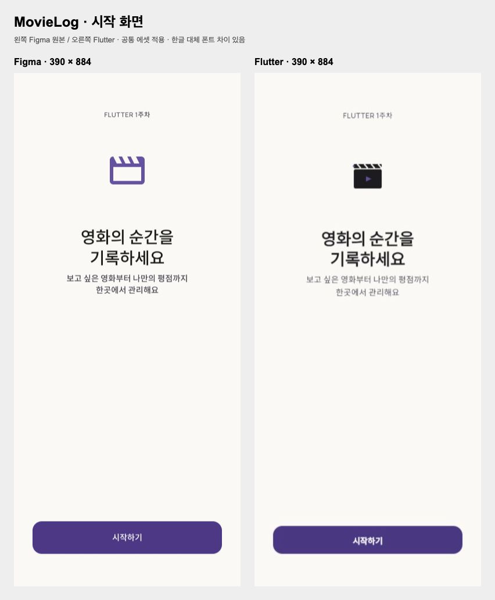

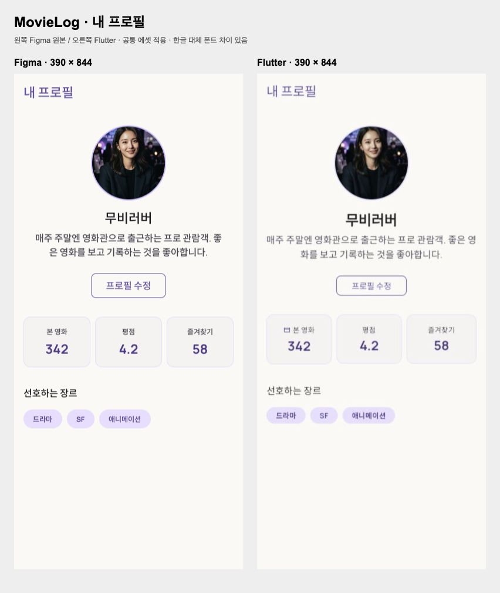

## 2주차: Form과 입력 상태

- 회원가입: `flutter run -d chrome -t lib/main_signup.dart`
- 평점 실습: `flutter run -d chrome -t lib/main_rating.dart`
- [Notion 복붙용 제출 문서·회고 초안](docs/week-2-submission.md)
- [Widget Tree·개념·상태 흐름](docs/week-2-learning.md)

닉네임·이메일·비밀번호의 한국어 Validator, 필수 약관, 가입 버튼 활성화와 제출 시 전체 검증을 구현했습니다. 비밀번호 표시/숨김, 공통 입력창, 700 이상 너비에서 최대 560 중앙 정렬 Challenge도 포함합니다. `flutter_rating_bar`로 0.5점 단위 평점 선택·화면 내부 저장·초기화를 지원합니다.

### 2주차 인증 화면

| 입력 전 | Validation 오류 | 입력 완료 |
| --- | --- | --- |
| 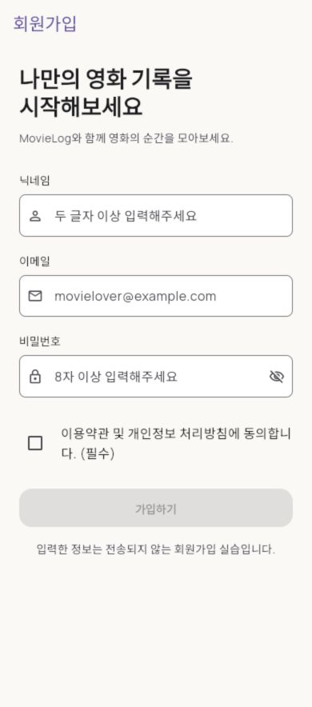 | 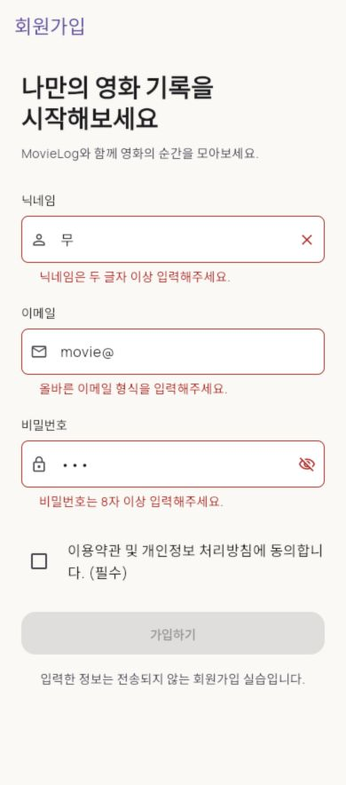 | 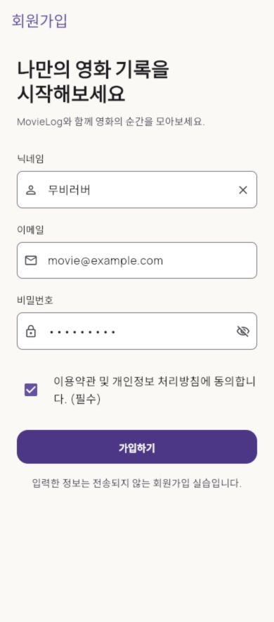 |

| 실제 Android 키보드 | 평점 선택 | 넓은 화면 |
| --- | --- | --- |
| 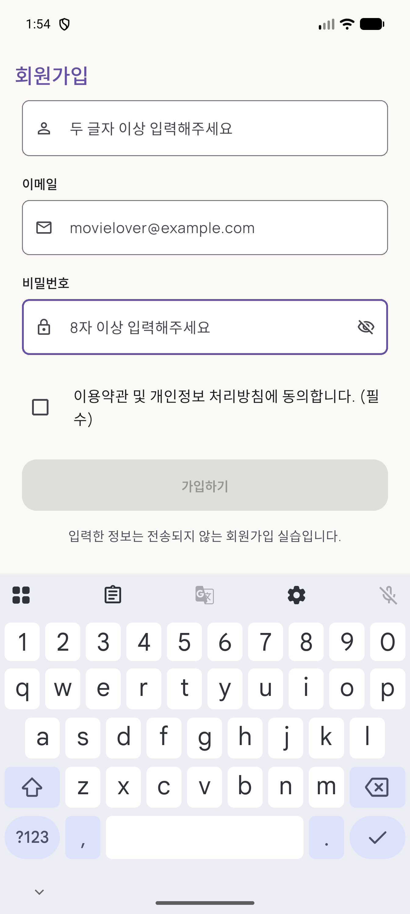 | 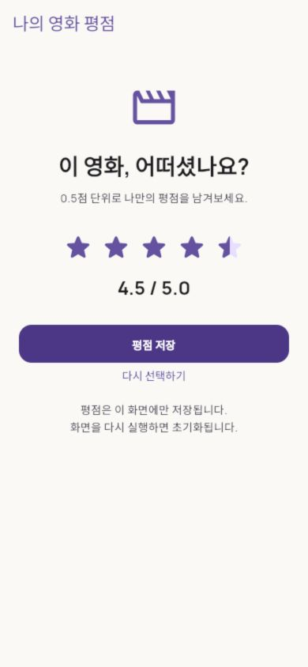 | 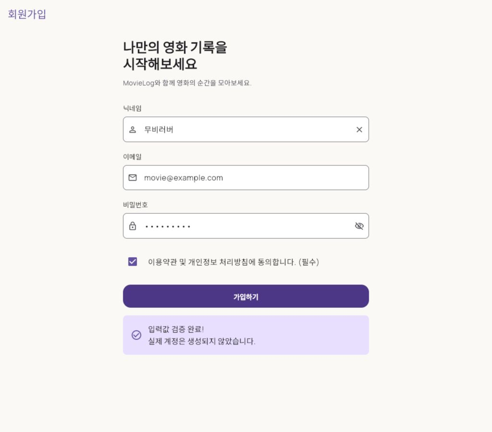 |

### 2주차 검증

- `flutter analyze`: 오류 없음
- `flutter test`: 11개 통과 (기존 1주차 테스트 포함)
- Android 실제 키보드 통합 테스트 1개 통과
- 회원가입·평점 웹 빌드 및 회원가입 Android 디버그 빌드 통과
- 브라우저에서 입력 전 → 오류 → 활성화 → 로컬 제출 완료, 평점 4.5 선택·저장, 1024 너비 확인

키보드 테스트: `flutter test integration_test/signup_keyboard_test.dart -d emulator-5554`

키보드 캡처 재생성: `python3 scripts/capture_week2_keyboard.py emulator-5554`

Figma 연결 도구의 권한 오류로 2주차 디자인의 픽셀 일치 검증은 수행하지 못했습니다. 워크북 기능 요구사항과 기존 MovieLog 테마를 기준으로 구현했습니다.
